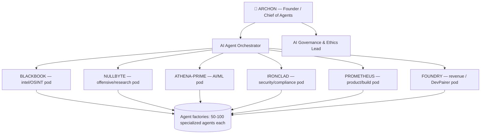

# The New Org Chart

## AI-native roles
- **Chief of Agents** — owns the digital agent workforce, sets objectives & guardrails.
- **AI Agent Orchestrator** — designs human↔agent workflows; composes specialized agents into outcomes.
- **AI Governance & Ethics Lead** — guardrails, audits agent decisions, accountability.
- **Outcome pods (2-5 humans)** — multidisciplinary, own an end-to-end business outcome + its agents.

Divisions map to the Cognis JTF (BLACKBOOK / NULLBYTE / ATHENA-PRIME / IRONCLAD / PROMETHEUS / FOUNDRY).
