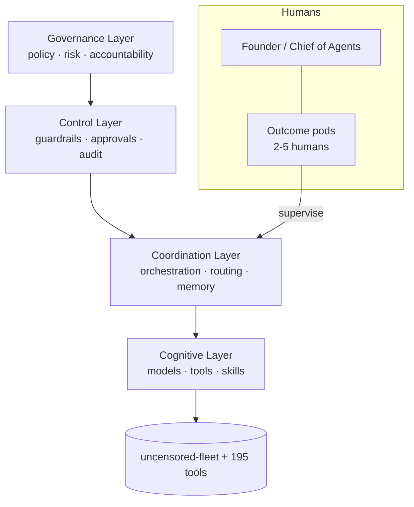

# cognis-operations

### How an **agentic company** actually runs — Cognis Digital's operating model, org chart, agent registry, and governance.

  

`#agentic-ai` `#operating-model` `#ai-native` `#org-design` `#governance`

A real, opinionated blueprint for running a company where **small human teams supervise factories of AI
agents**. This is how Cognis Digital operates — and a template you can fork.

- 🧠 [`OPERATING-MODEL.md`](OPERATING-MODEL.md) — the 4-layer agentic operating model
- 🗺️ [`ORG.md`](ORG.md) — the new org chart (humans + agent factories + AI-native roles)
- 🤖 [`AGENTS.md`](AGENTS.md) — the agent registry (roles, scopes, owners)
- 🛡️ [`GOVERNANCE.md`](GOVERNANCE.md) — human-in-the-loop, guardrails, audit & accountability
- 📚 [`SOURCES.md`](SOURCES.md) — McKinsey, Berkeley CMR, MIT Tech Review, Okta, NIST

## The operating model at a glance

## License
COCL v1.0 — see [LICENSE](LICENSE).
