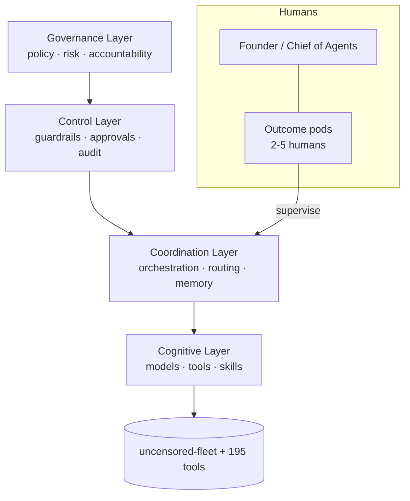

<div align="center">

# cognis-operations

### How an **agentic company** actually runs — Cognis Digital's operating model, org chart, agent registry, and governance.

[](LICENSE)  [](https://github.com/cognis-digital/cognis-neural-suite)

`#agentic-ai` `#operating-model` `#ai-native` `#org-design` `#governance`

</div>

## What is this?

This repository is a practical blueprint for running a company where a small team of people manages a large group of AI agents doing real work — writing code, conducting research, handling outreach, and more. It lays out how Cognis Digital is actually structured: the org chart, which AI agents exist and what they are allowed to do, and how humans stay in control of important decisions. If you want to understand or copy the model of an AI-native business — or you are building one yourself — this gives you a concrete, documented starting point with real governance rules rather than vague advice.

## Getting started

No installation is required — this is a documentation-only repository.

```bash
git clone https://github.com/cognis-digital/cognis-operations.git
cd cognis-operations
```

Then open the files below in any text editor or on GitHub:

- Start with [`OPERATING-MODEL.md`](OPERATING-MODEL.md) for the big picture.
- Read [`ORG.md`](ORG.md) to see the org chart and AI-native roles.
- Use [`AGENTS.md`](AGENTS.md) as a template for defining your own agent registry.
- Copy [`GOVERNANCE.md`](GOVERNANCE.md) and adapt the guardrails for your context.

To use the webhook forwarder (sends findings to a Slack/Jira/SIEM endpoint):

```bash
<tool> scan . --format json | python integrations/webhook.py --url https://your-endpoint
```

---

A real, opinionated blueprint for running a company where **small human teams supervise factories of AI
agents**. This is how Cognis Digital operates — and a template you can fork.

- 🧠 [`OPERATING-MODEL.md`](OPERATING-MODEL.md) — the 4-layer agentic operating model
- 🗺️ [`ORG.md`](ORG.md) — the new org chart (humans + agent factories + AI-native roles)
- 🤖 [`AGENTS.md`](AGENTS.md) — the agent registry (roles, scopes, owners)
- 🛡️ [`GOVERNANCE.md`](GOVERNANCE.md) — human-in-the-loop, guardrails, audit & accountability
- 📚 [`SOURCES.md`](SOURCES.md) — McKinsey, Berkeley CMR, MIT Tech Review, Okta, NIST

## The operating model at a glance



<a name="verification"></a>
## Verification


Every push is verified end-to-end. Latest audit (2026-06-13):

```text
tests        : 0 passed, 0 failed, 0 errored
compile      : all modules parse
cli          : n/a
package      : n/a
```

<details><summary>CLI surface (<code>--help</code>)</summary>

```text
(see --help)
```
</details>

Full machine-readable results: [`AUDIT.md`](AUDIT.md) · regenerate with `python -m cognis-operations --help` + `pytest -q`.

<div align="right"><a href="#top">↑ back to top</a></div>


## License
COCL v1.0 — see [LICENSE](LICENSE).

<!-- cognis:domains:start -->
## Domains

**Primary domain:** AI & ML  ·  **JTF MERIDIAN division:** ATHENA-PRIME · SAGE

**Topics:** `cognis` `ai` `llm` `machine-learning` `agent-security`

Part of the **Cognis Neural Suite** — 300+ source-available tools organized across 12 domains under the JTF MERIDIAN command structure. See the [suite on GitHub](https://github.com/cognis-digital) and [jtf-meridian](https://github.com/cognis-digital/jtf-meridian) for how the pieces fit together.
<!-- cognis:domains:end -->
