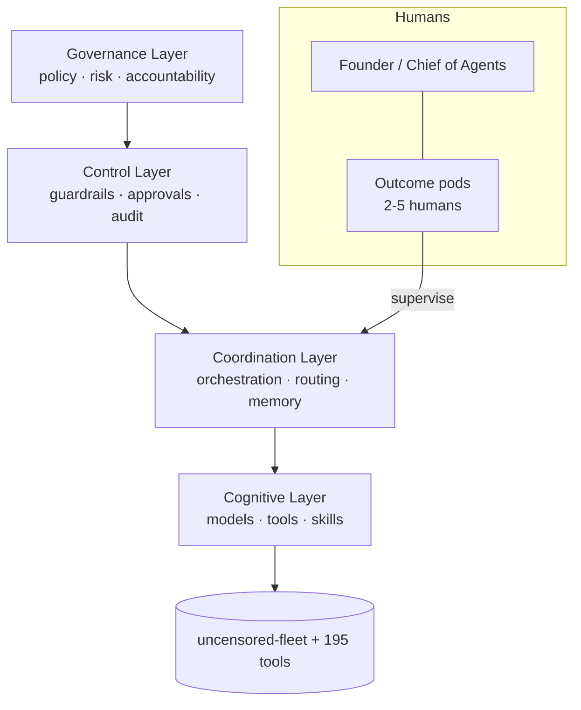

<div align="center">

# cognis-operations

### How an **agentic company** actually runs — Cognis Digital's operating model, org chart, agent registry, and governance.

[](LICENSE)  [](https://github.com/cognis-digital/cognis-neural-suite)

`#agentic-ai` `#operating-model` `#ai-native` `#org-design` `#governance`

</div>

A real, opinionated blueprint for running a company where **small human teams supervise factories of AI
agents**. This is how Cognis Digital operates — and a template you can fork.

- 🧠 [`OPERATING-MODEL.md`](OPERATING-MODEL.md) — the 4-layer agentic operating model
- 🗺️ [`ORG.md`](ORG.md) — the new org chart (humans + agent factories + AI-native roles)
- 🤖 [`AGENTS.md`](AGENTS.md) — the agent registry (roles, scopes, owners)
- 🛡️ [`GOVERNANCE.md`](GOVERNANCE.md) — human-in-the-loop, guardrails, audit & accountability
- 📚 [`SOURCES.md`](SOURCES.md) — McKinsey, Berkeley CMR, MIT Tech Review, Okta, NIST

## Usage — step by step

This repo is a documentation blueprint (no CLI) — an operating model you fork and adapt.

1. **Get the repo:**
   ```bash
   git clone https://github.com/cognis-digital/cognis-operations && cd cognis-operations
   ```
2. **Start with the operating model** — read [`OPERATING-MODEL.md`](OPERATING-MODEL.md) for the 4-layer agentic model (Governance -> Control -> Coordination -> Cognitive).
3. **Map it to your org** — adapt [`ORG.md`](ORG.md) (humans + agent factories + AI-native roles) and register your agents in [`AGENTS.md`](AGENTS.md) with roles, scopes, and owners.
4. **Put guardrails in place** — apply [`GOVERNANCE.md`](GOVERNANCE.md) for human-in-the-loop approvals, audit, and accountability before letting agent factories run.
5. **Keep it living in CI** — commit your forked `AGENTS.md` / `GOVERNANCE.md` to your own repo and review them in PRs, so the agent registry and guardrails stay version-controlled as your fleet grows. Sources behind the model are in [`SOURCES.md`](SOURCES.md).

## The operating model at a glance



## Interoperability

`{}` composes with the 300+ tool Cognis suite — JSON in/out and a shared
OpenAI-compatible `/v1` backbone. See **[INTEROP.md](INTEROP.md)** for the
suite map, composition patterns, and reference stacks.

## License
COCL v1.0 — see [LICENSE](LICENSE).
